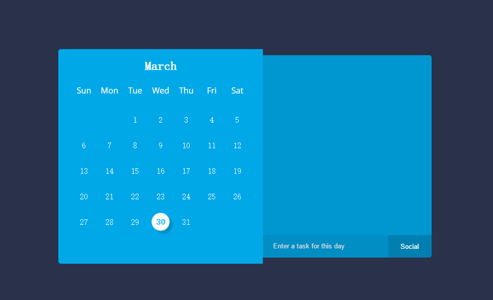

####我知道，没有图片你们是不会来的

#### 声明
这个效果是从 [这里](http://codepen.io/Jackthomsonn/pen/pyjXdJ).看见的，原文使用的angularJs实现的。
html代码使用了 haml，css 使用了scss。如果你喜欢，你也可以用 jade，less 来重写。
我重新使用 js 实现了一遍。包括css，html代码均为重新写的。

####示例
这里是一个[Demo](http://mogoethe.github.io/Jianshu/date.html).

#### 准备材料
1. sublime text3 编辑器
2. google浏览器 chrome 或者其他对css3兼容性比较好的浏览器。不要万恶的IE...

#### 整体思想
##### 1. 布局
很明显的看的出来这是一个左右布局，（既然是一个整体，那我们就把它装到一个盒子里面。就是body下面最外层的div呐）。
左右布局，我们再来左边来一个div，右边来一个div。分别为 div.left(emmet的快捷方式写法)，div.right 。剩下的内部的就看个人的喜欢了。
可以是 上下，也可以是上中下。
##### 2. 动画效果
每一单个日期的我点击事件是使用了一个弹动效果，原理就是一开始很小，然后变大，最后再缩小到一定程度停止。使用css3的 animation 的100%很容易
就能做到的。动画的过程，就是速度使用贝塞尔曲线自定义就好了，怎么好看怎么来。右侧的动画效果同理。不过是使用了 2d 转换。
##### 3. 默认样式的更改以及需要注意的地方。
I： 首先是盒子模型,其中有一段css的代码是这样的...

>
	.left .week-title{
		margin-top: 15px;
		width: 100%;
		display: -webkit-box;
	    display: -webkit-flex;
	    display: flex;
		height: 34px;
		font-family: 'Open Sans';
	}
	.left .week-title li{
		float: left;
		list-style: none;
		display: block;
		text-align: center;
		line-height: 34px;
		-webkit-box-flex: 1;    
	    -webkit-flex: 1;    
	    flex: 1;
	}

这里的三个display是一个兼容性写法，貌似还有另外一种兼容写法，百度一下，你就知道。我就不贴出来了。盒子模型的好处是横向布局的容器，内部的标签的占用宽度
是计算机自动计算的结果，肯定精确。 例如：我有一个div 用了一个盒子模型，他的宽度固定是500px；里面如果有5个标签并排，我已知其中一个为130px; 剩下4个的宽度一样，那么我剩下的四个只需要设置 flex: 1; 即可。如果有一天父级的宽度发生了改变，我这四个div的宽度也会自动重新计算，不怕装不满整个盒子了。

II : placeholder与滚动条的样式自定义。
>
	/* placeholder 颜色自定义 */
	input::-webkit-input-placeholder, textarea::-webkit-input-placeholder { 
	    color:    #ddd;
	}
	input:-moz-placeholder, textarea:-moz-placeholder { 
	    color:    #ddd;
	}
	input::-moz-placeholder, textarea::-moz-placeholder { 
	    color:    #ddd;
	}
	input:-ms-input-placeholder, textarea:-ms-input-placeholder { 
	    color:    #ddd;
	}
>
	/* 浏览器滚动条，前景色，背景色，滚动条颜色 ...  */
	.right .list::-webkit-scrollbar {
		width: 10px;
	} 
	.right .list::-webkit-scrollbar-track {
		background-color: #007fb0;
	}
	.right .list::-webkit-scrollbar-thumb {
		background-color: #00A8E8;
	}
	.right .list::-webkit-scrollbar-button {
		background-color: #007fb0;
	} 
	.right .list::-webkit-scrollbar-corner {
		background-color: black;
	}

III: css3动画的触发机制

其实html中有动画会产生的根本原因是标签的某一个属性发生了改变，例如：背景颜色，长度，宽度，透明度等等...。那么，为什么他的属性会发生改变呢？只有一个原因，
添加或者移除了 class，或者id 或者...。。那么我们要实现一个动画，只需要更改它不同class下面的状态不就好了么？ 至于过程，那就是你自己定义的了，动画从开始到结束需要多久，匀速，减速，加速？等等.....

####html代码
>
	

		

			

				<i class="icon-angle-left" id="prev"></i>
				<h2 class="header-title">March</h2>
				<i class="icon-angle-right" id="next"></i>
			

			<ul class="week-title">
				<li>Sun</li>
				<li>Mon</li>
				<li>Tue</li>
				<li>Wed</li>
				<li>Thu</li>
				<li>Fri</li>
				<li>Sat</li>				
			</ul>
			

				<ul class="dates"></ul>
			

		

		

			<ul class="list"></ul>
			

				<input type="text" placeholder="Enter a task for this day" value="" id="txtInput">
				<select name="thingstype" id="thingstype">
					<option value="Social">Social</option>
					<option value="Work">Work</option>
				</select>
			

		

	

#### css代码
> 代码就在这里 [Css代码](http://mogoethe.github.io/Jianshu/css/date3.css).

#### JS代码
> 代码就在这里 [Js代码](http://mogoethe.github.io/Jianshu/js/date.js).
